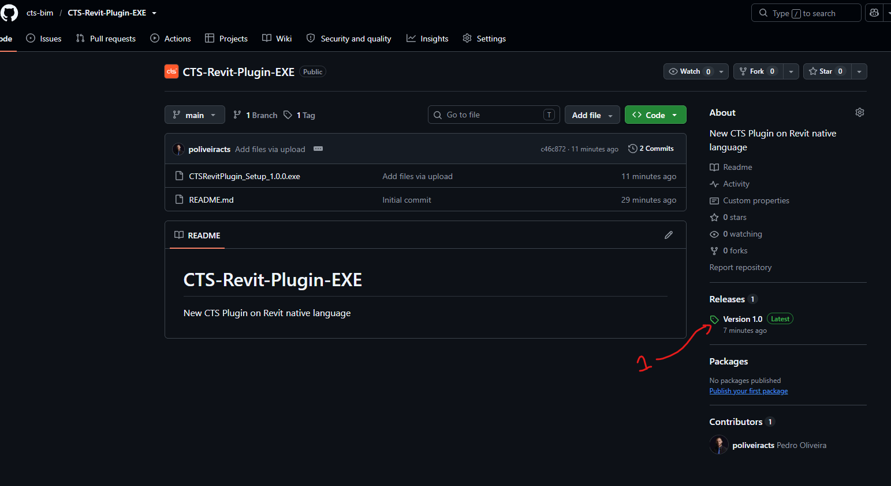
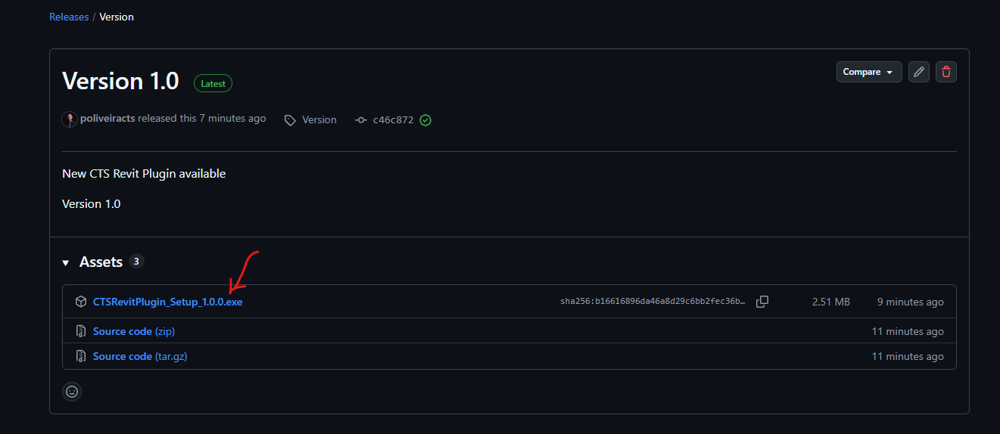
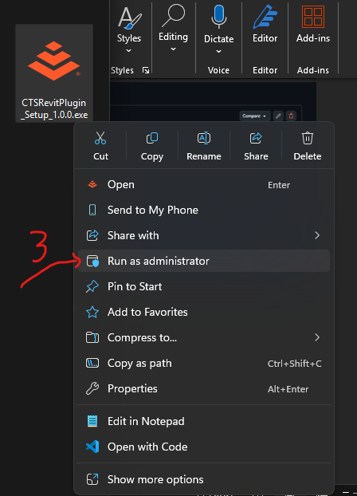
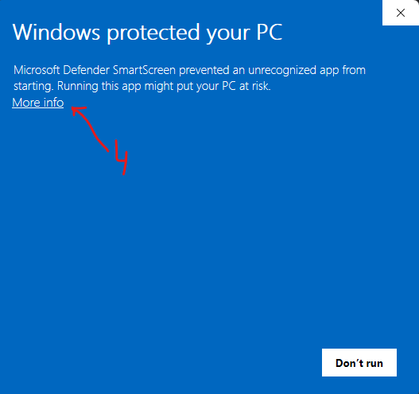
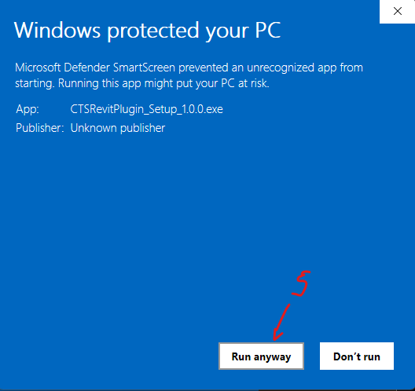
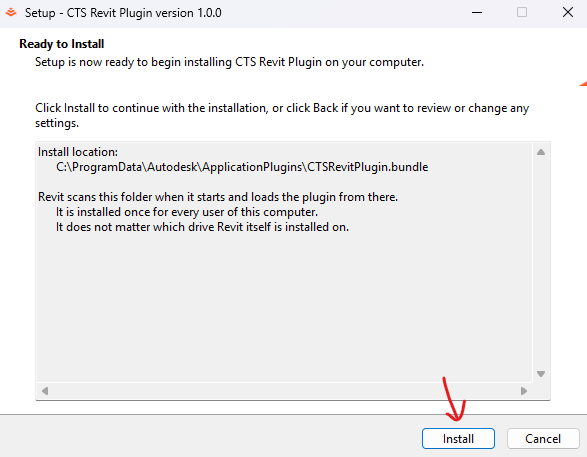

# CTS Revit Plugin — Installation Guide

The CTS Revit Plugin adds the **CTS Tools** ribbon tab to Revit, with the hanger,
annotation, modelling, QC and spooling tools, plus six dockable panes.

One installer covers **Revit 2023, 2024, 2025 and 2026**. You do not pick a
version — the installer puts all of them in place and Revit loads the right one.

**Requirements**

- Windows 10 or 11
- Revit 2023 or later, already installed
- Local administrator rights on the computer (the installer writes to a shared
  folder, not to your user profile)

---

## Step 1 — Open the latest release

Go to the repository:

<https://github.com/cts-bim/CTS-Revit-Plugin-EXE>

On the right-hand side, under **Releases**, click the version marked **Latest**.



> Do not download the **Source code (zip)** — that is the project's source, not
> the installer. You want the `.exe` in Step 2.

---

## Step 2 — Download the installer

On the release page, open **Assets** and click the setup file:

```
CTSRevitPlugin_Setup_1.0.0.exe
```

It is about 2.5 MB. Save it anywhere you like — your Downloads folder is fine,
and you can delete it after installing.



> **Optional, for the cautious:** the release page shows a `sha256` checksum next
> to the file. To confirm the download is intact, open PowerShell in the folder
> you saved it to and run
> `Get-FileHash .\CTSRevitPlugin_Setup_1.0.0.exe -Algorithm SHA256`.
> The value it prints should match the one on the page.

---

## Step 3 — Run it as administrator

**Close Revit first.** A running Revit holds the old plugin files open and the
installer cannot replace them.

Then right-click the downloaded file and choose **Run as administrator**.



> Plain double-clicking will not do. The plugin is installed once for the whole
> computer, in a folder a normal user account cannot write to, so without
> administrator rights the installer either fails or installs nothing.

---

## Step 4 — Get past the Windows warning: More info

Windows will show a blue **"Windows protected your PC"** screen. Click
**More info**.



**Why this appears, and why it is expected.** The installer is not
code-signed — signing needs a paid certificate — so Windows SmartScreen has no
publisher to recognise and warns about every unrecognised application by
default. It is not a virus report. If you want reassurance before continuing,
verify the checksum as described in Step 2.

---

## Step 5 — Run anyway

The panel expands to show the app name and *Publisher: Unknown publisher*.
Click **Run anyway**.



Windows may then ask you to confirm the administrator prompt. Accept it.

---

## Step 6 — Install

The setup window opens and shows where the plugin will go:

```
C:\ProgramData\Autodesk\ApplicationPlugins\CTSRevitPlugin.bundle
```

Click **Install**.



**What that location means:**

- Revit scans this folder every time it starts and loads the plugin from there.
- It is installed **once for every user of this computer** — your colleagues
  sharing the machine do not each need to run it.
- **It does not matter which drive Revit itself is installed on.** The plugin
  lives on `C:` regardless.

Installation takes a few seconds.

---

## Check that it worked

1. Start Revit and open any project.
2. Look for the **CTS Tools** tab on the ribbon.
3. The tab should carry the panels: Hanger, Annotation, Modeling, QC, Spooling,
   Utilities and Support.

If the tab is missing, see the troubleshooting notes below.

---

## Troubleshooting

**The CTS Tools tab does not appear.**

Check that the folder exists:

```
C:\ProgramData\Autodesk\ApplicationPlugins\CTSRevitPlugin.bundle
```

If it is not there, the installer did not complete — most often because it was
not run as administrator. Repeat from Step 3.

If the folder *is* there but the tab is not, Revit may have blocked the add-in
on startup. Revit asks once whether to load an add-in from an unknown
publisher, and answering *Do not load* is remembered. Reinstalling prompts the
question again.

**Revit warns about an unsigned add-in every time it starts.**

That is the same missing code signature as in Step 4. Choose **Always Load** and
Revit stops asking.

**The installer says a file is in use.**

Revit is still running, or is running under another Windows user on the same
computer. Close every instance and try again.

**Something misbehaves inside a tool.**

The plugin keeps its own log:

```
%LOCALAPPDATA%\CTSRevitPlugin\crash.log
```

Attach that file when reporting a problem — it usually names the exact tool and
element involved.

---

## Updating

Download the newer release and run it the same way, Steps 1 to 6. There is no
need to uninstall first; the installer replaces what is there. Close Revit
before you start.

## Uninstalling

Use **Settings → Apps → Installed apps**, find *CTS Revit Plugin*, and remove
it. Your settings files are left behind on purpose, so a later reinstall keeps
your profiles. They live in `%LOCALAPPDATA%\CTSRevitPlugin\` and can be deleted
by hand if you want a clean slate.

---

## Support

Questions, bugs and requests: <https://github.com/cts-bim/CTS-Revit-Plugin-EXE>

---

## Authors

- **Pedro Oliveira**
- **Bruno Dias**

